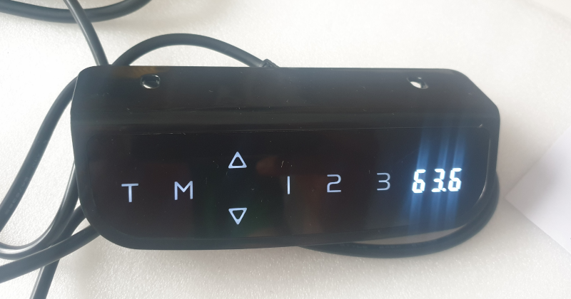
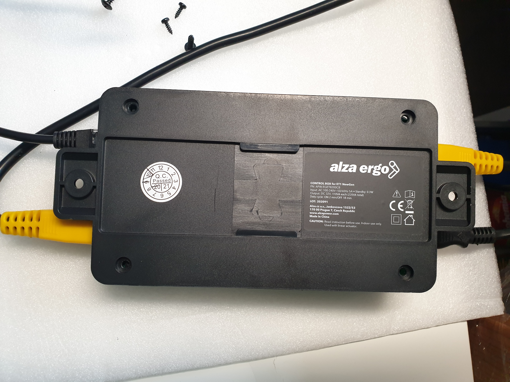
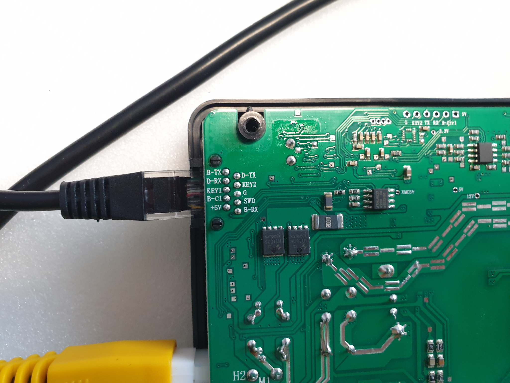
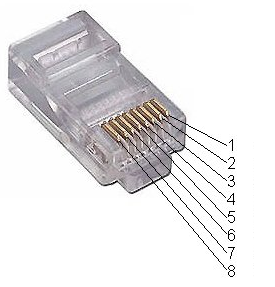
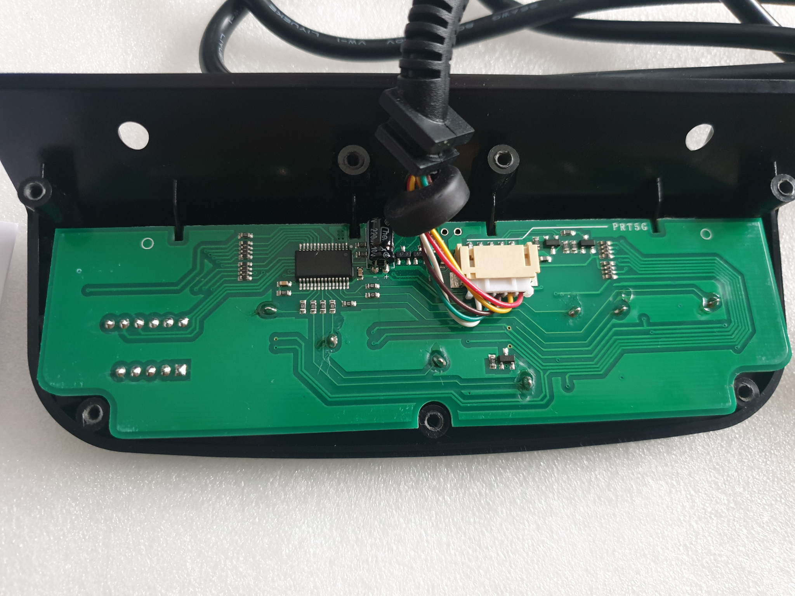
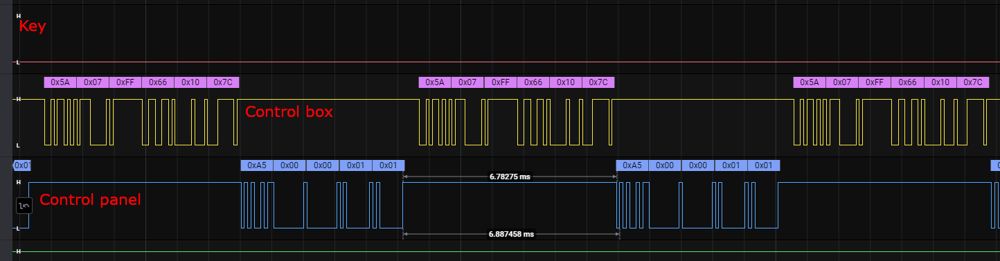
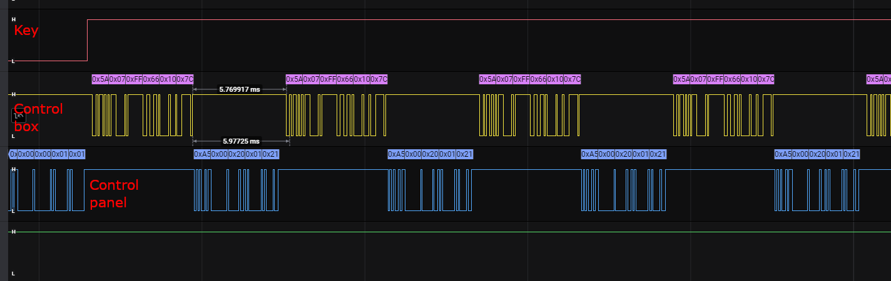

# AlzaErgo Table ET1 NewGen
This is my attempt to reverse engineer [AlzaErgo Table ET1 NewGen](https://www.alza.cz/alzaergo-table-et1-newgen-white-d5647311.htm) standing desk and add wi-fi functionality using something like Wemos D1/ESP8266.

The work is in progress.

# Components
### Control Panel
Controls height of the desk, show the current height on display, has memory for 3 positions, you can set min/max height, etc.



### Control Box
Contains the PowerSupply Unit, controls the motors and, gets commands from the Control Panel.



### Connection
The control box has a RJ-45 port. It seems like all 8 pins are being used but the provided Control Panel is only using 5 of them and does not wire the rest at all.



The wiring of the RJ45 port is as follows:

1. D-TX (green wire)
2. D-RX (brown wire; control panel transmits here)
3. unused
4. KEY-1 (white wire)
5. G (red wire)
6. unused
7. unused
8. +5V (yellow wire)

<br style="clear:both" />


Control Panel from the back: <br/>


## Protocol
The control flow is relatively straightforward and it is an endless loop of request (from control panel) and response (from control box) over
serial line. The serial line operates at 9600 bauds (8bit per frame, 1 stop bit, no parity bit, least significant bit first).

The request always starts with `0xA5` and uses the following structure: <br/>
``0xA5 [byte1] [byte2] 0x01 [checksum]``

The checksum is calculated as (where `&` is bitwise `AND`): <br/>
```(byte1 + byte2 + 0x01) & 0xff```

The response always starts with `0x5A` and uses the following structure: <br/>
```0x5A [byte1] [byte2] [byte3] [byte4] [checksum]```

Checksum in this case is ```(byte1 + byte2 + byte3 + byte4]) & 0xff```. The 3 bytes in response are the 3 characters displayed on the control panel and an
optional decimal point.

In addition to the serial communication there is also another channel (`Key`) which indicates a pressed button.

Here are two examples of communication between the panel and board

### Status (no action)
If there is no button pressed the `Key` pin is `LOW`, Control panel sends `0xA5 0x00 0x00 0x01 0x01` ("status") and the Control box replies with what to show on the built-in display (more on that later):



Here is another example while pressing the `UP` button on the control panel. In this case the `Key` pin is `HIGH`, control panel sends `0xA5 0x00 0x20 0x01 0x21` and Control box replies with what to show on the built-in display:



### Control panel commands (requests)

Panel sends one of the following commands:
```
0xA5 0x00 0x00 0x01 0x01    Idle/Get current display status
0xA5 0x00 0x20 0x01 0x21    Move up
0xA5 0x00 0x40 0x01 0x41    Move down
0xA5 0x00 0x60 0x01 0x61    UP and Down (used to reset)
0xA5 0x00 0x01 0x01 0x02    M button
0xA5 0x00 0x02 0x01 0x03    memory 1
0xA5 0x00 0x04 0x01 0x05    memory 2
0xA5 0x00 0x08 0x01 0x09    memory 3
0xA5 0x00 0x10 0x01 0x11    T button
0xA5 0x00 0x11 0x01 0x12    M+T (to get into settings)
```


### Control Box replies
The control box reply always follow this structure: `0x5A [byte1] [byte2] [byte3] [byte4] [checksum]` and bytes 1 to 3 represent three digits/letters on 7 segment [display](https://en.wikipedia.org/wiki/Seven-segment_display). Each bit in the byte corresponds to one segment. For example 8 is represented by `0b01111111` (or `0b11111111`; the topmost bit is not relevant):
```
   __0_
  |    |
5 |    | 1
  |__6_|
  |    |
4 |    | 2
  |____|
     3
```

Digit 6 can be represented as 0b01111101 (or 0b11111101)
```
   __0_
  |
5 |
  |__6_
  |    |
4 |    | 2
  |____|
     3
```

The top most bit of the middle byte is signaling the decimal point.
`0x06 0xbf 0x06` translates to `10.1` on display while `0x06 0x3f 0x06` translates to `101` on the display.

Here is a list of digits (the later always represent the digit and a decimal point) but the control box sends more letters than just this one.
| Digit | Hex                | binary                       |
|---    | ---                | ---                          |
| 0     | `0x3f` or `0xbf`   | `0b00111111` or `0b10111111` |
| 1     | `0x06` or `0x86`   | `0b00000110` or `0b10000110` |
| 2     | `0x5b` or `0xdb`   | `0b01011011` or `0b11011011` |
| 3     | `0x4f` or `0xcf`   | `0b01001111` or `0b11001111` |
| 4     | `0x66` or `0xe6`   | `0b01100110` or `0b11100110` |
| 5     | `0x6d` or `0xed`   | `0b01101101` or `0b11101101` |
| 6     | `0x7d` or `0xfd`   | `0b01111101` or `0b11111101` |
| 7     | `0x07` or `0x87`   | `0b00000111` or `0b10000111` |
| 8     | `0x7f` or `0xff`   | `0b01111111` or `0b11111111` |
| 9     | `0x6f` or `0xef`   | `0b01101111` or `0b11101111` |

The byte sequence of `5A 07 FD 6D 10 81 ` therefore corresponds to table height `76.5` cm (byte `07` corresponds to `7`, byte `FD` corresponds to `6.` and byte `6d` corresponds to `5`).

`Byte4` can have the following values:
| Value | Description |
|---    |---          |
| `0x00`  | Everything on the display is completely off
| `0x01`  | Timer indicator is turned on
| `0x10`  | 7 segment display is on (3 characters + decimal point)
| `0x11`  | 7 segment display is on as well as the timer indicator


### Timing
The request/reply over serial goes in a very quick succession (around 7ms per command or reply) and it seems like the control board is sensitive on the count of commands. E.g. I was unable to unlock the control panel from sleep (by holding `M` for 3 seconds) if the delay between commands was around `250ms`. Similarly the desk goes up/down slower if the delay between commands is longer (despite the fact the `Key` pin is still `HIGH`).